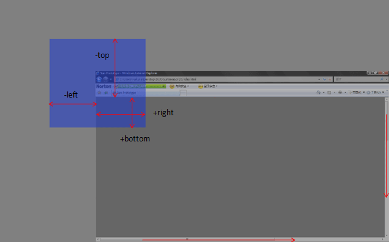

## 是否在可视区的不同尝试
### 1.getBoundingClientRect()
- 1.1 ele.getBoundingClientRect()获取得到的是ele元素相对于浏览器可见视口的上下左右的距离，盗用网上的两张图可以非常形象的看一下：
  
  
- 在不用考虑IE浏览器的移动端需求还是可以考虑用这个函数的。

### 2.是否在可视区的不同需求和尝试
#### 2.1元素整个完全在可视区才判定该元素在可视区
  - 条件判断分析：这里的H是可视区的高度也就是屏幕高度W是可视区宽度
    - top>=0,保证元素的上边距在可视区的顶部下面
    - bottom<H，保证元素的下边距在可视区的的底部的上面
    - left>0
    - right<W
  - 代码的实现如下：
    ```
    function inviewTotal(ele) { //元素整个完全在可视区
        
        let eleInfo = ele.getBoundingClientRect();
        let deviceH = document.documentElement.clientHeight || window.innerHeight || document.body.clientHeight,
            deviceW = document.documentElement.clientWidth || window.innerWidth || document.body.clientWidth,
            inviewH, inviewW;
        inviewH = eleInfo.top > 0 && eleInfo.bottom < deviceH;
        inviewW = eleInfo.left > 0 && eleInfo.right < deviceW;
        if (inviewH && inviewW) {
            let styleInfo = ele.style;
            if (styleInfo['display'] !== 'none' && styleInfo['visibility'] !== 'hidden' && styleInfo['opcity'] !== 0 && eleInfo.width > 0) {
                return true
            }
        }
        return false;
    }
    ```

#### 2.2部分元素在可视区即为元素在可视区
  - 条件判断分析：W,H的含义与上同
    - 纵向：0<bottom&&top<0 or top<H&&bottom>H
    - 横向：left<0&&right>0 or left<W&&right>W
  ```
  function inview(ele) { //部分在可视区
      if (inviewTotal(ele)) {
          return true;
      } else {
          let eleInfo = ele.getBoundingClientRect();
          let deviceH = document.documentElement.clientHeight || window.innerHeight || document.body.clientHeight,
              deviceW = document.documentElement.clientWidth || window.innerWidth || document.body.clientWidth,
              inviewH, inviewW;
          inviewH = (eleInfo.bottom > 0 && eleInfo.top < 0) || (eleInfo.top < deviceH && eleInfo.bottom > deviceH);
          inviewW = (eleInfo.left > 0 && eleInfo.right > 0) || (eleInfo.left < deviceW && eleInfo.right > deviceW);
          if (inviewH && inviewW) {
              let styleInfo = ele.style;
              if (styleInfo['display'] !== 'none' && styleInfo['visibility'] !== 'hidden' && styleInfo['opcity'] !== 0 && eleInfo.width > 0) {
                  return true
              }
          }
          return false;
      }
  }
  ```

  #### 换一种思路解决实际的问题
  - 需求分析：除了当前可见的区域，上下各一屏会被认为在显示区
  - 思路：求出当前被认为在可视区的范围，看需要被判断的元素是否在该范围内
    ```
    function getActiveView() { //上下各一屏会被认为在显示区
        // 获取图片显示区域
        var scrollTop = (document.documentElement.scrollTop || document.body.scrollTop); //获取当前页面滚动条纵坐标的位置
        var acDistance = window.innerHeight;
        // 图片显示区域最小高度和最大高度
        var active = {};
        active.top = scrollTop - acDistance; //滚动轴滚动的距离-可视区高度
        active.bot = scrollTop + (window.innerHeight || document.documentElement.clientHeight || document.body.clientHeight) + acDistance;
        active.left = 0;
        active.right = window.innerWidth || document.documentElement.clientWidth || document.body.clientWidth; //取得是逻辑像素，如：375
        active.scrollTop = scrollTop;
        return active;
    }

    function isInActive(elem) {
        // 获取元素位置
        var active = getActiveView();
        var _elem = elem;
        var rect = _elem.getBoundingClientRect && _elem.getBoundingClientRect(); //这里得到的是离可视区的距离
        var _elemTop, _elemBottom, _elemLeft, _elemRight;

        //兼容新老方法获取元素位置属性
        if (rect) {
            _elemTop = rect.top + active.scrollTop; //就是元素顶部里页面顶部的距离，不是可视区顶部是页面顶部
            _elemBottom = rect.bottom + active.scrollTop; //元素底部里页面顶部的距离
            _elemLeft = rect.left;
            _elemRight = rect.right;
        }
        // 判断元素是否在可视区
        var _isInActiveV = _elemBottom > active.top && _elemTop < active.bot; //_elemTop>active.top&&_elemBottom<active.bot是完全在可视区
        var _isInActiveH = _elemRight > active.left && _elemLeft < active.right; //_elemLeft> active.left&&_elemRight< active.right
        if (_isInActiveV && _isInActiveH) {
            var styles = _elem.style;
            if (styles) {
                if (styles['display'] != 'none' && styles['visibility'] != 'hidden' && styles['opacity'] !== '0' && _elem.offsetWidth) { //_elem.offsetWidth布局宽度
                    return true;
                } else {
                    return false;
                }
            } else {
                return true;
            }
        } else {
            return false;
        }
        return false;
    }
    ```

    #### 2.4总结：当然用第一种实现方式也能实现除了当前可见的区域，上下各一屏会被认为在显示区的需求，这里只是介绍了几种不同的实现思路而已。可以根据具体场景具体选择