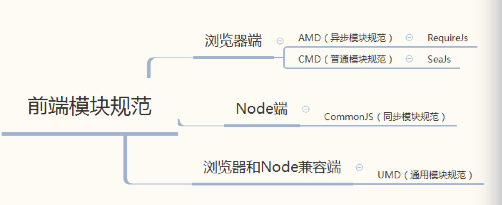

# javaScript模块规范

## amd && commonJS && CMD && UMD
- 首先amd只是模块规范，定义了其语法API，是 RequireJS 在推广过程中对模块定义的规范化产出。目前实现了amd规范的javaScript库有：requirejs和curl.js。其内容为: [https://github.com/amdjs/amdjs-api/wiki/AMD](https://github.com/amdjs/amdjs-api/wiki/AMD)

```
define([module-name?], [array-of-dependencies?], [module-factory-or-object]);
```

- commonJS也是一个规范，包含了module,package,system,binary(二进制),console,encoding,fs,sockets,unit testing等。它规定：一个文件就是一个模块，加载模块使用require该方法读取文件并执行，返回文件内部的exports对象，如果需要返回的不是对象而是函数则对exports重新赋值：
```
module.exports=function(){
  console.log('test');
}
```

  ### require
    - require：function,需要一个paths参数
    - require.resolve():解析后的绝对路径。
    - require.main:指向主模块，直接执行的时候require.main === module
    - 同一个模块只会在第一次加载的时候执行一次，之后结果会被缓存，以后再记载使用的是缓存数据。如果想让模块再次执行必须先清除缓存。
    ```
    require('./example.js');
    delete require.cache('./example.js');
    ```

  ### module对象
  - 属性：id,filename,children,parent,loaded,exports,path
    ```
    const jquery = require('jquery');
    exports.$ = jquery;
    ```

  ### exports变量
  - Node会为每个模块提供一个exports变量
  ```
  var exports = module.exports;
  ```

- CMD也是一个规范：是 SeaJS 在推广过程中对模块定义的规范化产出。[https://github.com/seajs/seajs/issues/242](https://github.com/seajs/seajs/issues/242)

  - 在 CMD 规范中，一个模块就是一个文件。代码的书写格式如下:```define(factory);```
    ### define
    - define是一个全局函数，用来定义模块。factory 参数，可以是一个函数，也可以是一个对象或字符串。factory 为函数时，表示是模块的构造方法，默认会传入三个参数：require、exports 和 module。
      ```
      define('add', ['math'], function(require, exports, module) {

        // 模块代码

      });
      ```
    - 所以可以用```if (typeof define === "function" && define.cmd)```判断页面是否有CMD模块加载器。
    ### require
    - require 是 factory 函数的第一个参数,是一个方法，其参数值必须是字符串直接量。
    - require.async:
      ```
      define(funciton(require,exports,module){
        require.async('./math',function(math){
          math.add();
        })
      })
      ```
    - require.resolve:返回解析后的绝对路径，但是不会加载模块。
    ### expoers
    - exports是一个对象
    - 下面三种写法效果是一样的
    ```
    define(function(require,exports,module){
      exports.sum=0;
      exports.add = function(x,y){
        return (x+y);
      }
    })
    ```
    ```
    define(function(require,exports,module){
      return{
        sum:0,
        add:function(x,y){
          return (x+y);
        }
      }
    });
    ```
    ```
    define({
      sum:0,
      add:function(x,y){
        return (x+y);
      }
    })
    ```
    - exports 仅仅是 module.exports 的一个引用。在 factory 内部给 exports 重新赋值时，并不会改变 module.exports 的值。因此给 exports 赋值是无效的，不能用来更改模块接口。
    ```
    define(function(require,exports,module){
      module.exports={
        sum:0,
        add:function(x,y){
          return (x+y);
        }
      }
    });
    ```
    ### module
    - module是对象
    - module.uri:模块绝对路径
    - module.dependencies:[],当前依赖
    - module.exports:Object,exports是modules.exports对象的一个引用




- UMD:从上图可以看出如果用CommonJS写的模块用在AMD的项目中是不行的，为了让AMD和CommonJS和谐共处，并支持global变量的形式，出现了UMD模式


## CMD&&AMD比较
CMD 推崇依赖就近，AMD 推崇依赖前置，AMD会在开始就require依赖，而CMD则是需要的时候require

## 写法举例
- 
```
//cmd
define(function(require, exports, modules) {
    function add(x, y) {
        return (x + y);
    }
    return { //return 的方法返回
        add: add
    };
});
//amd
define('amdDemo', [], function() {
    console.log('amdDemo');

    function amdDemoFun() {
        console.log('amdDemoFun');
        return 9;
    }
    return {
        amdDemoFun: amdDemoFun
    }
});
```

## 兼容Node,AMD,CMD以及浏览器的浏览器环境设置
```
(function(name, root, factory) {
    //amd or cmd
    if (typeof define === 'function') {
        define(name, ['b'], factory)
    } else if (typeof module === 'object' && module.exports) { //node
        factory(require('b'));
    } else { //global
        root[name] = factory(root.b);
    }
})('demo', typeof self !== "undefined" ? self : this, function(b) {
    return {};
});
```

